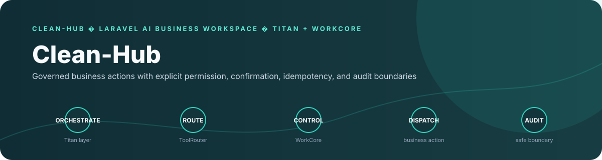
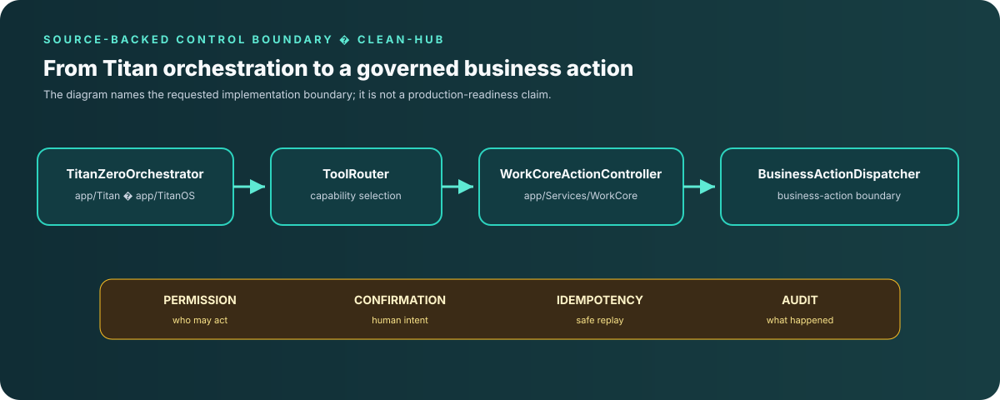

<div align="center">

# Clean-Hub

**A Laravel-based AI business workspace that brings conversational assistance and operational workflows into one company-scoped application.**

</div>

## Overview

Clean-Hub combines an AI interaction layer with a WorkCore domain foundation for customer, property, workforce, scheduling, service, and finance workflows. Its Titan orchestration layer routes requests through registered tools and WorkCore actions, with permissions, explicit confirmations, idempotency, and audit records enforced at the business-action boundary.


## Measured evidence

Clean-Hub contains a repository-native verifier rather than relying only on README claims.

The checked-in `tools/titan_verify.php` currently defines:

- **10 verification sections**: tenancy, platform, WorkCore, routes, maps, AI, intelligence, creative, UI and release;
- **98 required-path entries** across those sections;
- **152 explicit `$check(...)` call sites** in the verifier source, with some checks executed inside loops so runtime check totals can differ.

Run the verifier from the repository root:

```bash
php tools/titan_verify.php
```

The verifier checks concrete invariants including:

- request bodies cannot supply authoritative `company_id` to the tenant resolver;
- company membership participates in context resolution;
- Vault values are encrypted/decrypted through Laravel Crypt;
- WorkCore donor/incomplete subsystems remain quarantined;
- Titan routes require authentication and active company context;
- WorkCore actions use the governed `BusinessActionDispatcher`;
- Titan Zero reads use registered WorkCore read models and the shared read executor.

This is structural/runtime-contract verification. It does not establish provider quality, deployed browser behavior or production readiness.

## What is new

Clean-Hub's technical signature is a **single governed business-action boundary shared by AI-assisted and ordinary application writes**.

```text
Conversation / API request
        ↓
TitanZeroOrchestrator
        ↓
Registered ToolRouter capability
        ↓
BusinessActionDispatcher
        ↓
Tenant + operation context
        ↓
Entitlement + permission
        ↓
Explicit confirmation
        ↓
Idempotency replay check
        ↓
Database transaction
        ↓
Audit + domain events
```

The important point is that the model does not become a second write authority. Once an AI request wants to change business state, it is forced back through WorkCore's ordinary tenant, permission, confirmation, idempotency and audit controls.

## Product problem

AI assistants become useful in business software when they can understand the active company, retrieve bounded operational data, and hand write operations to the same policies as the rest of the application. Clean-Hub is built around that boundary: conversational requests stay in context, registered tools decide what is available, and WorkCore remains responsible for authorized business changes.

## Verified capabilities

| Capability | Source-backed implementation | Why it matters |
| --- | --- | --- |
| Conversational AI | [`TitanZeroOrchestrator`](app/Titan/AI/TitanZeroOrchestrator.php) builds conversation context, asks the configured assistant for a response, and accepts only a strict JSON tool envelope when a business action is requested. | Keeps ordinary conversation separate from executable operations and gives the application one controlled AI persona. |
| Multi-provider completion | [`AiCompletionService`](app/Services/Ai/AiCompletionService.php) routes text and image-aware completion through the configured engine, including OpenAI, Anthropic, Gemini, DeepSeek, and xAI adapters. | Makes provider choice an application concern instead of coupling every feature to one SDK. |
| Tool and action routing | [`ToolRouter`](app/Titan/AI/ToolRouter.php) resolves registered capabilities, WorkCore actions, and read models under the active company context. It rejects tenant overrides, checks permissions, and records success or failure. | Gives AI tool use the same tenancy and audit boundary as direct application requests. |
| Transactional business actions | [`BusinessActionDispatcher`](app/Domains/WorkCore/System/Actions/BusinessActionDispatcher.php) checks tenant and operation context, entitlements, permissions, and explicit confirmation before running an idempotent transaction with audit and domain-event recording. | Makes high-impact AI-assisted writes reviewable, repeatable, and policy-aware. |
| Operational foundation | [`WorkCoreServiceProvider`](app/Domains/WorkCore/WorkCoreServiceProvider.php) registers capabilities, actions, read models, tenancy, authorization, outbox, notifications, and operational modules. | Separates the business-action kernel from individual vertical workflows. |
| Declarative interactions | [`interactions/ai_assisted.json`](interactions/ai_assisted.json) defines an AI-assisted quote wizard; [`interactions/new_customer.json`](interactions/new_customer.json) defines a permissioned CRM customer wizard. | Keeps interaction questions, validation, permissions, and capability names inspectable as data. |

<p align="center">
  
</p>

## Architecture

```text
Conversation or API request
          │
          ▼
TitanZeroOrchestrator
          │  strict tool envelope
          ▼
ToolRouter ───────────────► registered capability / read model
          │
          ▼
BusinessActionDispatcher
          │
          ├─ active company + operation context
          ├─ entitlement + permission checks
          ├─ explicit confirmation
          ├─ idempotency replay protection
          └─ transaction → handler → audit + domain events
```

The public WorkCore route group is defined in [`app/Domains/WorkCore/Routes/api.php`](app/Domains/WorkCore/Routes/api.php). The operational provider loads the registered `operations`, `scheduling`, `dispatch`, `recurring`, `forms`, `repairs`, and `fleet` module groups. [`vertical_operations.php`](app/Domains/WorkCore/Config/vertical_operations.php) defines cleaning, pressure-washing, gardening, handyman, and plumbing service vocabularies with durations, tasks, skills, forms, and compliance metadata.

Those configuration and module surfaces provide the domain model and integration points; they are not by themselves a claim that every vertical is fully enabled end to end. Follow the enabled routes, migrations, handlers, and tests for the workflow you want to run.

## AI request surfaces

The authenticated API exposes distinct paths for conversational and generation workflows in [`routes/api.php`](routes/api.php):

- `aichat` for conversations, templates, history, search, and streamed responses.
- `airealtimechat` for realtime conversations, websocket credentials, and conversation persistence.
- `aiwriter` for generator metadata, streamed text output, saving, and favourites.
- `aiimage` for model versions, availability checks, image generation, and recent images.
- `aivoiceover` for text-to-speech preview and generation.
- `v1/shared-credit` for company-scoped usage and cost visibility.

These routes sit behind the application authentication boundary. Provider keys and account configuration belong in the environment, never in source control.

## Optional AI site-builder bridge

The repository also contains a separately deployable AI site-builder bridge under [`integrations/ai-site-builder/`](integrations/ai-site-builder/). Its design keeps MagicAI/Titan Zero responsible for identity, active-company context, permissions, launch sessions, correlations, and audit records while the external React/Vite/Supabase builder owns generated projects and build artifacts.

The bridge documents HMAC signing, nonce replay protection, one-use launch sessions, idempotent callbacks, company-scoped identifiers, and secret-file sanitisation. It is an isolated integration surface and must be populated, configured, and tested independently before being described as a deployed product capability.

## Quickstart

Clean-Hub is a Laravel application with a Node-based frontend toolchain.

### Prerequisites

- PHP 8.2 or newer
- Composer
- Node.js and npm
- A database supported by the Laravel configuration

### Install and build

```bash
composer install --no-interaction --prefer-dist
cp .env.example .env
php artisan key:generate
php artisan migrate
npm ci
npm run build
```

Run the application with the Laravel environment appropriate to your host. The root Composer manifest defines `test` and `test:lint`; the root `package.json` defines `build`, `dev`, and frontend maintenance scripts.

```bash
composer test
composer test:lint
```

Configure only the AI providers and integrations you intend to use. The checked-in [`.env.example`](.env.example) is the starting point for local configuration.

## Repository map

| Path | Role |
| --- | --- |
| [`app/Titan/AI/`](app/Titan/AI/) | Titan Zero orchestration, context building, and tool routing. |
| [`app/Services/Ai/`](app/Services/Ai/) | Provider-aware text and image completion services. |
| [`app/Domains/WorkCore/`](app/Domains/WorkCore/) | Company context, capabilities, actions, read models, modules, events, outbox, and operational routes. |
| [`routes/api.php`](routes/api.php) | Authenticated AI, image, voice, usage, and application API surfaces. |
| [`interactions/`](interactions/) | Declarative interaction specifications for AI-assisted and CRM workflows. |
| [`integrations/ai-site-builder/`](integrations/ai-site-builder/) | Isolated site-builder bridge design, installer, patches, and security contract. |
| [`.github/workflows/`](.github/workflows/) | Laravel, architecture, recovery, and integration automation. |
| [`tests/`](tests/) | Application and domain verification suites. |

## Engineering decisions

- **One business-action boundary:** AI calls do not write directly to arbitrary tables; registered actions pass through WorkCore policy and transaction handling.
- **Company context is explicit:** tool input cannot override the active company, and WorkCore validates both tenant and operation context.
- **Safe retries are designed in:** idempotency records, correlation IDs, audit records, and domain events are part of the action dispatcher contract.
- **Provider adapters stay behind services:** application features ask for completion while the service selects the configured engine and model.
- **Integration ownership is separated:** the optional site-builder bridge cannot become a second authority for WorkCore business records.

## Maintenance tooling

The repository includes `.titan/scripts/` for branch inventory, recovery planning, validation, and report generation. Those scripts support repository maintenance around the application; they are not the main product surface. Their current behavior has important limits: `replay-commits.js` does not check out the supplied recovery branch before cherry-picking, and its shell helper swallows command failures; `validate-merge.js` invokes `npm test` even though the root `package.json` does not define a `test` script. Treat these helpers as maintenance work in progress, not as reliable conflict detection, passing test evidence, or an automatic merge authority.

## Evidence and boundaries

The evidence review for this README was refreshed against pre-edit `main` commit `2597f2ed8edf3113028ac8abc20160b39e545e06` on 2026-10-05. The branch may move after this update, so treat that SHA as an audit snapshot rather than a permanent current-head claim. The strongest implemented story is the combination of AI orchestration, provider adapters, WorkCore actions, company context, permissions, confirmation, idempotency, and audit/event recording.

Builds, provider calls, browser flows, external site-builder deployment, and production readiness require verification in an environment with the required dependencies and credentials. The maintenance validator is not a passing test report: its root `npm test` command currently has no matching package script, and the replay helper has the branch/error-handling gaps described above.

## Provenance, licensing, and attribution

Clean-Hub contains upstream MagicAI/Laravel application material alongside Titan Zero and WorkCore integration code. Preserve the upstream attribution, license, and notice files carried by the repository and its imported packages; this README does not relicense donor code or claim original authorship for upstream portions. Review the provenance of imported packages and donor sources before redistribution.