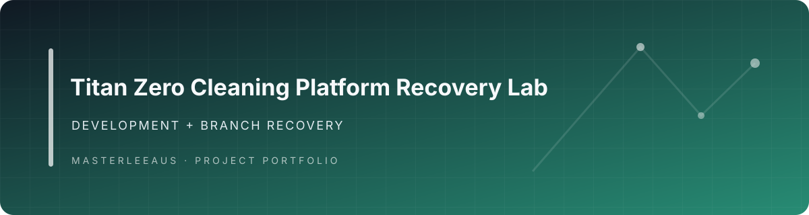

<div align="center">

# Clean-Hub

**A branch-recovery and source-integrity workbench for bringing valuable changes back into a coherent codebase.**

</div>

Clean-Hub gives maintainers a practical way to understand a busy Git repository, choose which work is worth recovering, replay it on a controlled branch, and leave behind an inspectable record of what happened. It is especially useful when parallel feature work, generated changes, or AI-assisted development have produced more branches than the team can safely integrate by hand.

## Why it exists

Recovering a branch is rarely just a merge command. The maintainer needs to know how far the branch has diverged, which commits and files are unique, what conflicts are likely, and whether the recovered result still builds and tests. Clean-Hub turns that decision into a staged workflow with small JSON and Markdown artifacts that can be reviewed, shared, and regenerated.

**Best fit:** engineering teams maintaining a Laravel application with a large branch surface, or developers building operational tooling for AI-heavy, multi-branch workflows.

## What the system does

Clean-Hub is a Laravel codebase with a focused Node.js recovery toolkit exposed through the root `package.json`.

| Capability | Implementation | Value to a maintainer |
| --- | --- | --- |
| Branch inventory | [`.titan/scripts/scan-branches.js`](.titan/scripts/scan-branches.js) compares every local branch with `main` and records ahead/behind counts, unique commits, changed files, author, and last-modified date. | Makes recovery candidates visible before anyone starts cherry-picking. |
| Recovery planning | [`.titan/scripts/plan-recovery.js`](.titan/scripts/plan-recovery.js) creates a `recovery/<branch>` plan with commits to replay, build/test steps, audit checks, and a risk assessment. | Converts an ambiguous branch into a reviewable sequence of decisions. |
| Conflict-aware replay | [`.titan/scripts/replay-commits.js`](.titan/scripts/replay-commits.js) replays commits in order, counts successful and failed picks, records conflicts, and aborts a conflicted cherry-pick for manual review. | Preserves an explicit audit trail instead of hiding integration problems. |
| Merge validation | [`.titan/scripts/validate-merge.js`](.titan/scripts/validate-merge.js) checks branch existence, runs `npm run build` and `npm test`, verifies `main` ancestry, and records whether the result is safe to continue reviewing. | Separates a technically passing build from a branch that still needs architectural review. |
| Review reports | [`.titan/scripts/generate-reports.js`](.titan/scripts/generate-reports.js) turns the branch registry into summary and branch-health Markdown reports. | Gives reviewers a concise operational view without opening every generated JSON file. |

## Architecture at a glance

```text
Local Git refs
    │
    ▼
scan-branches.js ──► .titan/registry/branches.json
    │
    ▼
plan-recovery.js ──► .titan/recovery/<branch>.json
    │
    ▼
replay-commits.js ─► .titan/recovery/replay.json
    │
    ▼
validate-merge.js ─► .titan/audits/validation-<branch>.json
    │
    ▼
generate-reports.js ► .titan/reports/summary.md
                         .titan/reports/branch-health.md
```

The design keeps the recovery state in repository-local artifacts rather than a hidden service. That makes the workflow easy to inspect in code review and gives each phase a clear handoff: inventory, plan, replay, validate, report.

## Engineering choices

- **Git is the source of truth.** The scanner derives branch state from the checkout instead of maintaining a second branch database.
- **Recovery is explicit.** Plans name the source branch, recovery branch, commits to replay, expected build/test commands, and risk fields before integration begins.
- **Conflicts stay visible.** A conflicted cherry-pick is aborted and recorded for manual resolution; the tool does not silently manufacture a merged result.
- **Validation is honest about coverage.** Build, test, and ancestry checks can fail the validator. Duplicate-class, import-resolution, and architecture checks are recorded as `not_run` when this script does not implement them, so a green build is not presented as a full merge certification.
- **Outputs are reviewable.** JSON registries support automation while Markdown reports provide a human-friendly handoff.

## Quickstart

The recovery toolkit runs locally against the branches available in your checkout.

### Prerequisites

- Node.js 18 or newer
- npm
- Git with the branches you want to inspect

### Run the recovery workflow

```bash
npm ci

# Inventory local branches and write .titan/registry/branches.json
npm run titan:scan

# Create summary and branch-health reports
npm run titan:report

# Generate the current duplicate-report artifact
npm run titan:detect-duplicates

# Create a plan for a branch identified by the scan
npm run titan:plan -- feature/branch-name

# Validate a recovery branch after replaying its commits
npm run titan:validate -- recovery/branch-name
```

The commands write generated state beneath `.titan/registry/`, `.titan/recovery/`, `.titan/audits/`, and `.titan/reports/`. Run them from a disposable or review branch when you want to keep generated artifacts separate from application work.

### Laravel application

The repository also contains a substantial Laravel application. Its Composer manifest defines the application dependencies and the `test` and `test:lint` scripts; the recovery toolkit itself only requires the Node.js setup above. For application work, use the repository's normal environment configuration and CI workflow after installing Composer dependencies.

## Repository map

| Path | Role |
| --- | --- |
| [`.titan/scripts/`](.titan/scripts/) | Executable branch scan, planning, replay, validation, and report stages. |
| [`.titan/README.md`](.titan/README.md) | Detailed recovery-tool documentation and command index. |
| [`.titan/registry/`](.titan/registry/) | Branch and duplicate-report artifacts produced by the workflow. |
| [`.titan/recovery/`](.titan/recovery/) | Recovery plans and replay results. |
| [`.titan/audits/`](.titan/audits/) | Validation outputs. |
| [`.titan/reports/`](.titan/reports/) | Human-readable summaries. |
| [`app/`](app/) | Laravel application code and domain services. |
| [`.github/workflows/`](.github/workflows/) | Laravel and Titan recovery automation. |
| [`TITAN_SYSTEM_IMPLEMENTATION_SUMMARY.md`](TITAN_SYSTEM_IMPLEMENTATION_SUMMARY.md) | Historical implementation map with the checked-in scope and workflow descriptions. |

## Evidence and current scope

At the current `main` tip (`b7d30b7`, reviewed 2026-10-04), the repository contains executable implementations for branch scanning, recovery planning, commit replay, build/test/ancestry validation, and report generation. The README links each headline capability to its source file so the portfolio story can be checked against the implementation.

The duplicate detector currently emits a baseline report with zero detected sets and follow-up recommendations; it is a reporting contract, not proof that semantic duplicate analysis has been completed. The merge validator likewise marks duplicate, import, and architecture checks as `not_run` when they are outside its implemented scope. Those boundaries are intentional: Clean-Hub is strongest as a traceable recovery workflow and integration aid, not as an autonomous merge authority.

Clean-Hub is supporting infrastructure for disciplined AI-assisted development workflows. It does not claim to be an LLM runtime or to make merge decisions without human review.

## License and attribution

The application retains its repository-level licensing and attribution files. Review those files before redistributing application code or generated recovery artifacts.